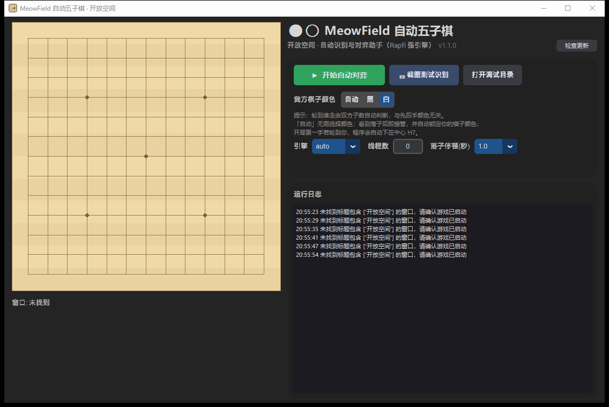

# MeowField_AutoGomoku 使用说明书

**版本 1.1.0** · 作者与软件署名：薮猫 · 项目仓库：github.com/Tsundeer/MeowField_AutoGomoku

面向 Windows 的《开放空间》五子棋自动识别与对弈工具

对游戏《开放空间》（进程 `launcher.exe`，窗口标题"开放空间"）的五子棋小游戏进行
**自动识别对方落子 + AI 自动落子** 的桌面工具。分辨率无关，支持任意窗口位置。



## 功能

- **棋盘识别**：截图定位棋盘面板 → 拟合 13×13 网格交叉点 → 逐点分类（空 / 黑子 / 白子）。
  完全基于颜色与几何结构，分辨率变化、窗口移动均不影响（已在 720p~1440p 缩放下验证）。
- **开源强引擎 [Rapfi](https://github.com/dhbloo/rapfi)**（Gomocup 五子棋 AI 冠军引擎，GPL-3.0），
  已内置 `engines/` 目录，以子进程运行（Gomocup/Piskvork 协议）。
  引擎与颜色无关：我方执黑执白都由程序自动适配。
- **执色（游戏中先手/后手的颜色并不固定，程序不依赖此假设）**：
  - `自动（推荐）`：无需选择。看到任何一方落子后即接管应招；程序点击后棋盘上
    出现的棋子颜色即"我方颜色"（铁证自动锁定）。若点击未生效（说明那步是你
    手动下的），会自动纠正颜色并等待对方落子后接管。
  - `黑` / `白`：直接指定你方棋子颜色。
  - **轮次判定与颜色解耦**：双方轮流落子，"子少的一方行棋"——程序按双方子数
    自动判断当前是否轮到你，不关心先后手。开局第一手若轮到你，先手动下一子，
    程序会自动续下；中盘随时开启即可接管。
- **先手开局"下中间"**：空盘时开启自动，程序第一步自动落中心 H7（同游戏里
  流传的先手必胜套路），随后由引擎接管——它会自己走出连续双杀的强制路线；
  若实际还没轮到我方（对方先手），试探点击不会生效，程序自动转为等待接管。
- **防误点保护**：
  - 连续两次读到相同局面才确认"对方落子"；
  - 鼠标悬停的半透明预览子会被自动忽略（新"落子"若正好在鼠标所在交叉点，
    先移开鼠标复核）；
  - 落子前把鼠标移到目标点再复核一次，排除对方棋子的预览误判；
  - 点击前校验前台窗口（必要时预热点击），点击后等待棋盘上真的出现我方棋子，
    超时自动重试；
  - 检测到棋盘重置自动开始新一局。
- **可视化**：GUI 实时显示识别到的棋盘、日志、"截图测试识别"一键保存调试图。

## 安装

**方式 A（推荐）：直接下载 exe**

到 [Releases](../../releases) 下载 `MeowField_AutoGomoku_win64.zip`，
解压后双击 `MeowField_AutoGomoku.exe` 即可（免 Python 环境，已内置 Rapfi 引擎）。

**方式 B：源码运行**

需要 Windows 10/11 与 Python 3.9+。

```bat
pip install -r requirements.txt
双击 一键启动.bat   （或 python main.py）
```

源码运行需自行下载 Rapfi 引擎（可选，缺失时使用内置简易引擎）：
到 [Rapfi Releases](https://github.com/dhbloo/rapfi/releases) 下载
`Rapfi-engine.7z`，解压到项目根目录的 `engines/` 下。

### 自己打包 exe

```bat
scripts\build_exe.bat
```

产物：`dist\MeowField_AutoGomoku\`（目录版）与 `dist\MeowField_AutoGomoku_win64.zip`。

## 使用

1. 启动游戏，进入五子棋对局界面（棋盘出现）。
2. 启动本程序（exe 或源码），程序自动找到游戏窗口并开始识别（左侧显示实时棋盘）。
3. 点 **截图测试识别** 确认识别正常（会保存调试图到 `debug/`）。
4. 选择我方棋子颜色，点 **▶ 开始自动对弈**。
5. 之后每当对方落子，程序会延时后自动计算并点击落子。

## 工具

| 命令 | 作用 |
| --- | --- |
| `python tools/calibrate.py samples/board_1080p.png` | 对截图运行识别并输出叠加调试图 |
| `python tools/calibrate.py --live` | 对当前游戏窗口实时识别 |
| `python tools/test_detector.py` | 识别器回归测试（多分辨率+合成棋子） |
| `python tools/test_engine.py` | 内置兜底引擎战术/性能测试 |
| `python tools/test_rapfi.py` | Rapfi 协议连通测试 |

## 参数

- **引擎思考预算**：Rapfi 每步 20 秒（`config.py` 的 `RAPFI_TURN_TIME_MS`）。
  算到必胜/必败会提前秒下；均势局面走满预算换取棋力（深度约为 1 秒限时的
  两倍以上）。
- **线程数**：界面可调（0 = 用满全部逻辑核，本机 28 线程）。也可以改
  `engines/config.toml` 的 `default_thread_num`。
- **GPU 加速**：不支持。Rapfi 是 CPU NNUE 引擎（int8 + AVX2 SIMD），
  官方没有 GPU 后端；已用满 CPU 全核即为其最大算力。
- **落子停顿**：识别到对方落子后的等待时间（默认 1 秒，随机 ±30%），让节奏更自然。
- 引擎选择：`auto`（找到 rapfi 就用，否则内置纯 Python 引擎）/ `rapfi` / `simple`。
- 阈值类参数在 `config.py`，针对游戏默认棋盘皮肤标定；若游戏换肤导致识别异常，
  用 `tools/calibrate.py` 输出的调试图对照调整。

## 注意事项

- 游戏窗口**不能被完全遮挡**（截图优先走 PrintWindow，部分显卡/独占全屏可能拿不到画面，
  此时请使用窗口化模式；程序会自动回退到屏幕区域抓取）。
- 自动对弈期间尽量别把鼠标停在棋盘上（悬停预览子会触发防幻影复核，拖慢节奏）。
- 引擎思考与点击均针对 13×13 无禁手自由规则。
- 请自行评估游戏内使用自动化工具的合规风险，仅供学习交流。

## 项目结构

```
main.py          GUI 入口
config.py        全局配置/阈值
detector.py      棋盘识别（面板定位/网格拟合/落子分类）
window.py        窗口查找、截屏（PrintWindow→mss 回退）、前台化、点击
gomoku_ai.py     AI 封装：Rapfi 子进程（Gomocup 协议）+ 内置引擎兜底
engine.py        内置纯 Python 五子棋引擎（α-β + 窗口计分）
auto_player.py   自动对弈状态机（后台线程）
tools/           标定与测试脚本
samples/         标定用截图
engines/         Rapfi 引擎（官方 250615 版，含各指令集构建，自动选择）
```

## 致谢与许可

- 本工具代码基于 **GPL-3.0** 开源（见 [LICENSE](LICENSE)）。
- 内置对弈引擎 [Rapfi](https://github.com/dhbloo/rapfi)（Gomocup 冠军引擎），
 版权归原作者所有，同样遵循 **GPL-3.0** 开源，其源码可在其仓库自由获取。
- 感谢游戏《开放空间》玩家社区分享的先手开局思路。

> 免责声明：本工具仅供学习交流使用，请自行评估在游戏中使用自动化工具的合规风险。

## 数据与日志位置

- 用户设置：`%LocalAppData%\MeowField_AutoGomoku\settings.json`（原子写入，含 `.bak` 备份）
- 运行日志：`%LocalAppData%\MeowField_AutoGomoku\logs\`（按日滚动，保留 14 天）
- 调试截图：`%LocalAppData%\MeowField_AutoGomoku\debug\`（界面「打开调试目录」直达）

## 开发者文档

- 架构说明：[docs/ARCHITECTURE.md](docs/ARCHITECTURE.md)
- 打包与发布：[docs/packaging-and-updates.md](docs/packaging-and-updates.md)
- 测试：`python -m pytest tests/`
